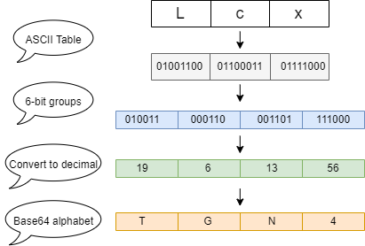

# Encode & Decode Base64

## Base64

> 参考 https://en.wikipedia.org/wiki/Base64

在计算机编程中，Base64 是**一组二进制到文本的编码方案**，它将二进制数据转换为可打印字符序列，仅限于一组 64 个唯一字符。更具体地说，源二进制数据一次取 6 位，然后这组 6 位被映射到 64 个唯一字符之一。

**例如/for example：**

- 起初文本：Lcx

- 转化后的二进制数据：TGN4A

**速记：**base64，六位比特，2 ^ 6 = 64

## 原理

> 图解感觉更快

### encode

### decode

### ASCII Table

> 参考 https://www.ascii-code.com/

### Base64 alphabet

> 参考 https://en.wikipedia.org/wiki/Base64

## 简单实现

> 代码在src/index.ts

**快速运行：**

- 拉仓库

- pnpm install
- pnpm start

## 值得一提

我们尝试看 chrome 实现的atob & btoa

- 由于base64转换过程中，会有位数对齐的诉求，以`M`为例
  - 按我们上述【原理】分析下来，结果应该是`TQ`
  - 那为什么此处是`TQ==`呢？
    - 原来是因为，Base64 将输入的 ASCII 文本的每3个字节（24位）分成4个Base64字符（每个字符代表6位）。如果输入文本的长度不是3的倍数，会出现不足24位的情况：
      - **如果输入长度对3取余为1**（即只剩下一个字节，8位），则这个字节会被转化为Base64的第一个字符的前6位，并且用两个等号`==`作为填充。
      - **如果输入长度对3取余为2**（即剩下两个字节，16位），这两个字节会被转化为Base64的前两个字符的前12位，并且用一个等号`=`作为填充。
      - 所以你可以回到【Base64 alphabet】看到index为63下面的【Padding】